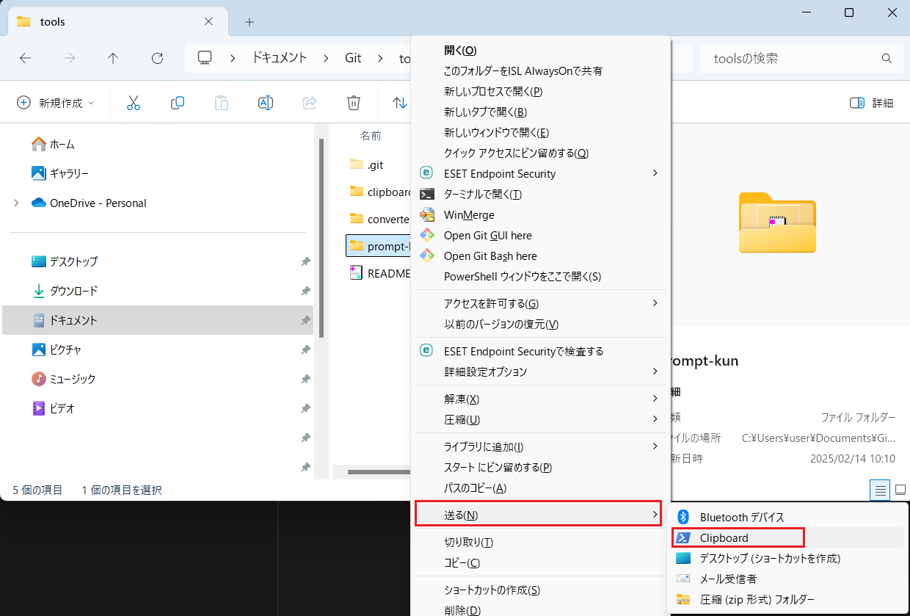

# Clipboard Tool

## 概要
このツールは指定したテキストファイルの内容をMarkdown形式でクリップボードにコピーします。複数ファイルやディレクトリを指定可能で、再帰的に処理します。Windowsでの使用を想定しています。



## 対応ファイル形式
以下の拡張子のテキストファイルに対応しています：
- .txt, .md, .csv, .log
- .json, .xml, .yml, .yaml
- .ini, .conf, .config
- 各種プログラミング言語ファイル（.ps1, .py, .js, .javaなど）

## SendTo経由での使用方法
1. 以下のパスにショートカットを作成：
```
C:\Users\user\AppData\Roaming\Microsoft\Windows\SendTo\Clipboard.lnk
```
2. ショートカットのプロパティで「リンク先」に以下を設定：
```
C:\Windows\System32\WindowsPowerShell\v1.0\powershell.exe C:\Users\user\Documents\tools\clipboard\Clipboard.ps1
```
※パスは環境に応じて変更してください。

3. ファイルを右クリック → 「送る」→ 「Clipboard」を選択

## 注意事項
- UTF-8で保存されるファイルのみ対応
- クリップボードにコピーされる内容はMarkdown形式
- 対応していないファイル形式はスキップ
- 大きなファイルを処理する際は時間がかかる場合あり


## PowerShellの実行ポリシー変更

PowerShellを実行しようとした際に、「このシステムではスクリプトの実行が無効になっている」というエラーが発生することがあります。
これはPowerShellのセキュリティ設定が原因で、スクリプトの実行が制限されているためです。
 
この問題を解決するには、PowerShellの実行ポリシーを変更する必要があります。
 
警告: 実行ポリシーの変更はセキュリティリスクを伴う可能性があります。信頼できるスクリプトのみを実行するように注意してください。
 
以下の手順で実行ポリシーを変更できます。
 
#### 管理者権限でPowerShellを開く
 
スタートメニューで「PowerShell」を検索し、右クリックして「管理者として実行」を選択します。

#### 現在の実行ポリシーを確認する
 
以下のコマンドを実行します。
 
```
Get-ExecutionPolicy
```
Restrictedと表示された場合、スクリプトの実行は制限されています。

#### 実行ポリシーを変更する
 
以下のいずれかのコマンドを実行します。

RemoteSigned (推奨): ローカルで作成したスクリプトと、インターネットからダウンロードした信頼できる発行元によってデジタル署名されたスクリプトの実行を許可します。

```
Set-ExecutionPolicy RemoteSigned
```

Unrestricted: すべてのスクリプトの実行を許可します。セキュリティリスクが高いため、注意が必要です。

```
Set-ExecutionPolicy Unrestricted
```

#### 変更を確認する
 
もう一度Get-ExecutionPolicyコマンドを実行し、変更が適用されたことを確認します。

## ライセンス

このプロジェクトはMITライセンスの下で提供されています。