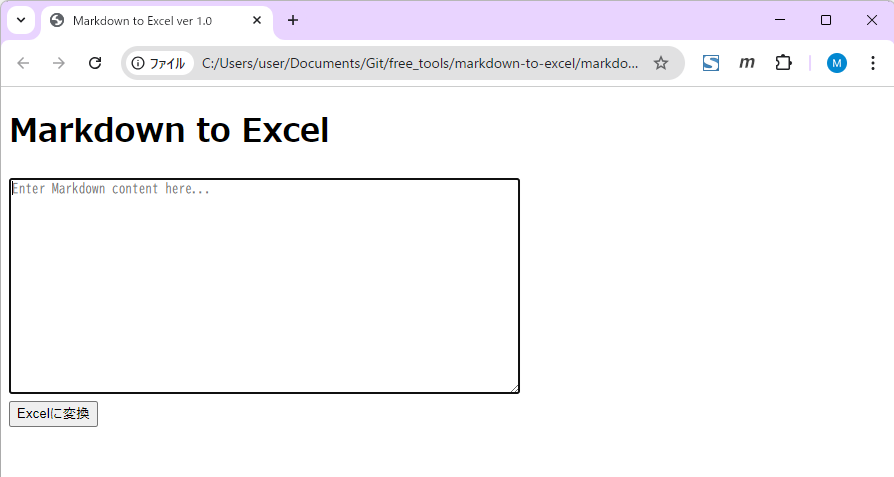

# markdown-to-excel.html

## 概要

- ブラウザ上で動作するクライアントサイドの Markdown から Excel(.xlsx) への変換ツールです。
- JavaScript (ExcelJS) を利用して、入力された Markdown をその場で Excel ファイルに変換し、ダウンロード可能にします。

## 使用方法

1. ローカル環境に `markdown-to-excel.html` を配置
2. ブラウザで `markdown-to-excel.html` を開く
3. テキストエリアに Markdown を入力
4. 「Excelに変換」ボタンをクリック
5. 自動的に `.xlsx` ファイルのダウンロードが開始されます

**注意点**  
- 大きな Markdown テキストや複雑なレイアウトの場合、ExcelJS の制限・処理時間に注意してください。

## ライセンス

このプロジェクトはMITライセンスの下で提供されています。
