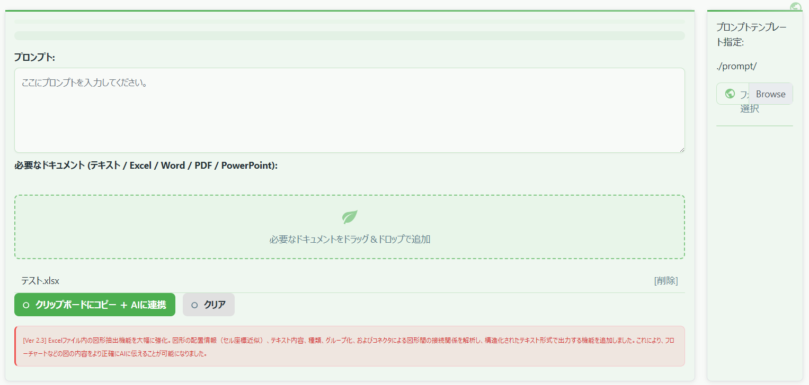

# プロンプトくん ver 1.6

「**プロンプトくん**」は、テキストファイルをはじめ、Excel・Word・PDF・PowerPoint などのドキュメントをドラッグ＆ドロップで読み込み、抽出したテキストとともに指定のプロンプトをクリップボードにコピーするための HTML/JavaScript アプリケーションです。  
コピー後は、対話型AI サイト（デフォルトでは [https://XXXXXXXXXX/](https://XXXXXXXXXX/) ）が自動的に起動し、すぐにプロンプトとドキュメント内容を連携できます。



画面左側にはプロンプト入力エリアとドキュメントのドロップゾーン、右側にはプロンプトテンプレート一覧が配置されています。  
ドラッグ＆ドロップで各種ドキュメントを追加し、「**クリップボードにコピー ＋ AIに連携**」ボタンを押すことで、テキスト抽出と AI サイトへの連携を一括で行えます。

---

## 構成ファイル

1. **prompt-kun.html**  
   - アプリケーションのメイン画面（HTML）。テキストエリアやドキュメントのドロップゾーンを配置しています。  
   - Bootstrap でレイアウトを簡易的に整えています。  
   - スタイルシート (`styles.css`) とスクリプト (`scripts.js`) を読み込み、機能を実現します。

2. **scripts.js**  
   - ドラッグ＆ドロップで受け取ったファイルの読み込み・テキスト抽出処理をまとめた JavaScript。  
   - Excel、Word、PDF、PowerPoint など各ファイル形式に応じたライブラリを利用し、テキストを解析・抽出するロジックが含まれています。  
   - 抽出したテキストをまとめてクリップボードにコピーし、対話型AI サイトを自動的に別タブで開きます。  
   - **Excel / Word / PowerPoint 内の図形テキスト** や **Excel のコメント**, **Word / PowerPoint のノートや段落構造**, **PDF のレイアウト保持** なども、なるべく取得できるようになっています。

3. **styles.css**  
   - 全体の配色やレイアウトなど、見た目を調整するための CSS。  
   - 背景色やスクロールバーの色などをカスタマイズしています。

---

## 使い方

1. **ファイルを配置する**  
   `prompt-kun.html`, `scripts.js`, `styles.css` を同一フォルダ内に配置してください。  
   （または同等のパス構成になるように配置してください）

2. **ブラウザで `prompt-kun.html` を開く**  
   - Chrome や Edge などのモダンブラウザを推奨します。  
   - ローカルのダブルクリックでも基本的には動作しますが、PDF・Word 抽出などで CORS エラーが出る場合があります。  
   - エラーが出る場合は、簡易ローカルサーバー（例: `npm install -g http-server`）を立ち上げ、`http://localhost:8080` などからアクセスすると安定します。

3. **プロンプトを入力**  
   - 画面左側の「プロンプト:」欄に、AI に投げたい指示や質問などを入力してください。  

4. **参考ドキュメント（ドラッグ＆ドロップ or フォルダ選択）**  
   - 画面右側の「フォルダを選択」ボタンから、プロンプトテンプレート集などがあるフォルダを選択すると、そのフォルダ内のファイルリストが表示されます。  
   - 任意のファイル名をクリックすると、テキスト領域にその内容が反映されます（`★★★★★` 区切りで「プロンプト」「説明」「必要なドキュメントリスト」を自動で分割表示）。  
   - 画面左の「必要なドキュメントをドラッグ＆ドロップで追加」エリアに、Excel / Word / PDF / PowerPoint などをドラッグ＆ドロップすると、ファイルが読み込み候補に追加されます。

5. **内容をコピーして AI に連携**  
   - 「**クリップボードにコピー ＋ AIに連携**」ボタンを押すと、テキストエリアとドラッグ＆ドロップしたファイルの中身をすべてテキスト化・連結し、クリップボードへコピーします。  
   - コピーが完了すると、自動的に [https://XXXXXXXXXX/](https://XXXXXXXXXX/)（デフォルト設定）を新しいタブで開きます。  
   - AI サイト上の入力欄で貼り付け（Ctrl+V / Cmd+V）すると、抽出結果＋プロンプトがすぐに利用できます。  
   - なお、コピー内容の末尾には自動で  
     ```
     以上がインプット情報です。冒頭の指示に従ってください。
     ```  
     といった文言が付与されます。

6. **クリア**  
   - 「**クリア**」ボタンを押すと、入力したプロンプトやドロップしたファイル情報がすべてリセットされます。

---

## 主な機能

- **複数拡張子対応**  
  - `.xlsx`, `.xls` (Excel)  
    - シート内の値・コメント、図形内の文字列も取得  
  - `.docx`, `.doc` (Word)  
    - 段落・リスト・表構造・図形内の文字列もできる限り取得  
    - ※ `.doc` は古い形式のため失敗する場合あり。`.docx` 推奨  
  - `.pdf` (PDF)  
    - テキストをなるべくレイアウトを保った形で抽出  
  - `.pptx`, `.ppt` (PowerPoint)  
    - スライド、ノート、図形内のテキストを取得  
    - ※ `.ppt` は古い形式であり、抽出が不完全な場合あり。`.pptx` 推奨  
  - 一般テキストファイル（拡張子 `.txt`, `.md` など）  
    - エンコード自動判定に対応（文字コードが不明な形式の場合は失敗する場合あり）

- **抽出結果の自動連結・コピー**  
  - ドロップした複数ファイルを順次テキスト解析し、すべて連結してクリップボードにまとめます。  
  - コピー完了後、AI サイトを自動で開くため、素早くプロンプトを利用できます。

- **簡易テンプレート読み込み**  
  - 右側の「フォルダを選択」からプロンプトテンプレートの集まるフォルダを指定すると一覧が表示され、ファイルをクリックするだけでテキスト領域に流し込めます。  
  - テンプレートファイルを `★★★★★` 区切りで作成すれば、プロンプト・説明・必要ドキュメントリストの 3 つの欄に自動反映されます。

---

## 使用ライブラリ

HTML 内部で、以下の外部ライブラリ（CDN）を使用しています。  
オフライン環境で使用する場合は、それぞれローカルに配置し `scripts.js` や `prompt-kun.html` でパス指定を行ってください。

- **[Bootstrap 4.3.1](https://getbootstrap.com/)**  
  UI/レイアウト用デザインフレームワーク  
- **[jQuery 3.3.1](https://jquery.com/)** / **[Popper.js 1.14.7](https://popper.js.org/)**  
  Bootstrapの機能に必要  
- **[encoding-japanese 2.0.0](https://github.com/polygonplanet/encoding.js/)**  
  文字コード判定用  
- **[xlsx 0.18.5](https://github.com/SheetJS/sheetjs)**  
  Excel ファイル解析用  
- **[pdf.js 2.16.105](https://mozilla.github.io/pdf.js/)**  
  PDF テキスト抽出用  
- **[mammoth 1.5.1](https://github.com/mwilliamson/mammoth.js)**  
  Word (docx) 解析用  
- **[jszip 3.10.1](https://stuk.github.io/jszip/)**  
  docx/pptx など zip 構造ファイル展開用（図形抽出など）  
- **[pako 2.1.0](https://github.com/nodeca/pako)**  
  圧縮データ解凍用  

---

## 動作上の注意

1. **CORS (Cross-Origin Resource Sharing) エラーについて**  
   - ローカルファイルを `file:///` 経由で直接開く場合、一部ブラウザで CORS エラーが発生し、PDF 読み込みが失敗することがあります。  
   - その場合はローカルサーバーを立ち上げ、`http://localhost:8080` などからアクセスしてください。

2. **ファイルサイズ・ページ数が大きい場合**  
   - PDF でページ数が非常に多い場合や、サイズが大きい Office ファイルを読み込む場合、ブラウザメモリや CPU 負荷が増大し、時間がかかることがあります。  
   - 必要に応じて小分けして読み込むか、簡易要約などを別途行うことを検討してください。

3. **Word `.doc` や PowerPoint `.ppt` 形式**  
   - `.doc` や `.ppt` は古い形式のため、完全に解析できない場合があります。  
   - `.docx`, `.pptx` への変換を推奨します。

4. **図形のテキスト抽出**  
   - Excel / Word / PowerPoint では、シート・文書・スライド上の図形（テキストボックス・吹き出し等）の文字列をできる限り抽出します。  
   - ただし、オブジェクト間の矢印や配置情報までは取得できません。

---

## カスタマイズ方法

1. **コピー後に開くサイトの変更**  
   - `scripts.js` 内の `copyText()` 関数にある  
     ```js
     window.open("https://XXXXXXXXXX/", "_blank");
     ```  
     をお好みの対話型AIサイトに書き換えてください。

2. **コピー内容（ヘッダー・フッター）の変更**  
   - 同じく `scripts.js` 内の `copyText()` 関数で、コピー結果に付与されるヘッダー／フッターを編集できます。  
   - デフォルトではヘッダーは空、フッターとして  
     ```
     以上がインプット情報です。冒頭の指示に従ってください。
     ```  
     が付与されます。

3. **スタイル変更**  
   - `styles.css` を編集することで、色やレイアウトなどを自由に変更できます。

4. **ファイルの読み込みロジックを拡張**  
   - Excel, Word, PDF, PowerPoint 以外の特殊ファイル形式を解析したい場合は、`scripts.js` 内で拡張子ごとの分岐を追加・編集し、対応するライブラリを導入するなどの改修を行ってください。

5. **プロンプトテンプレートの作成例**  
   - テキストファイルを次のように `★★★★★` で区切っておくと、  
     ```
     [1] AIへの指示内容
     ★★★★★
     [2] テンプレートの説明
     ★★★★★
     [3] 必要なドキュメントのリスト
     ```
     ファイルをクリックした際に、それぞれの欄（「プロンプト」「説明」「必要なドキュメント」）へ自動的に割り当てられます。

     プロンプトテンプレート内に「●●●」が含めると、送信ボタン押下時に、
     アラートで「プロンプトの「●●●」の部分を書き換えてください。」というメッセージが表示され、
     処理が中止されます。
     これは、テンプレートの未編集部分が残ったままAIに送信されることを防ぐための安全機能として実装されています。

6. **置換ワードの追加方法**  
   - `scripts.js` を開きます。  
   - `copyText` 関数内の `replacements` 配列を見つけます。  
   - 以下の形式の要素を追記します：  
     ```js
     const replacements = [
         { before: "置換前ワード1", after: "置換後ワード1" },
         { before: "置換前ワード2", after: "置換後ワード2" },
         // ここに追加
         { before: "Foo", after: "Bar" }
     ];
     ```

---

## ライセンス

このプロジェクトはMITライセンスの下で提供されています。
